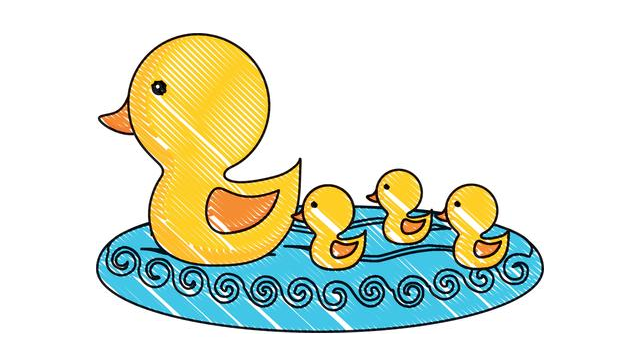

# ducks

Redux Ducks Interface

> Image source: [PNG BARN](https://www.pngbarn.com/png-image-biwfd)

## Princples

1. [Ducks: Redux Reducer Bundles - A proposal for bundling reducers, action types and actions when using Redux](https://github.com/erikras/ducks-modular-redux)
1. [Ducks++: Redux Reducer Bundles](https://medium.com/@DjamelH/ducks-redux-reducer-bundles-44267f080d22)

## Developing Tools

- [Typesafe utilities designed to reduce types verbosity and complexity in Redux Architecture](https://github.com/piotrwitek/typesafe-actions)

## Links

- [Why I Chose to Modularize the Ducks in My React App // Lauren Lee // CascadiaJS 2018](https://www.youtube.com/watch?v=jr7D4VAzNig&t=960s)
- [Redux: Another implementation for Selector Pattern](https://stackoverflow.com/q/53265572/1123955)
- [Scaling your Redux App with ducks](https://www.freecodecamp.org/news/scaling-your-redux-app-with-ducks-6115955638be/)
- [Modular Reducers and Selectors](https://randycoulman.com/blog/2016/09/27/modular-reducers-and-selectors/)
- [Where do I put my business logic in a React-Redux application?](https://medium.com/@jeffbski/where-do-i-put-my-business-logic-in-a-react-redux-application-9253ef91ce1)
- [Idiomatic Redux: Thoughts on Thunks, Sagas, Abstraction, and Reusability](https://blog.isquaredsoftware.com/2017/01/idiomatic-redux-thoughts-on-thunks-sagas-abstraction-and-reusability/)
- [Redux Ecosystem Links - A categorized list of Redux-related addons, libraries, and utilities](https://github.com/markerikson/redux-ecosystem-links)

## History

### master

### v0.2 (May 2020)

Thanks [@gobwas](https://github.com/gobwas) for letting me use this great NPM module name `ducks` for my project, Appreciate it!

## Author

[Huan LI](https://github.com/huan) ([李卓桓](http://linkedin.com/in/zixia)) zixia@zixia.net

## Copyright & License

- Code & Docs © 2020-now Huan LI \<zixia@zixia.net\>
- Code released under the Apache-2.0 License
- Docs released under Creative Commons
